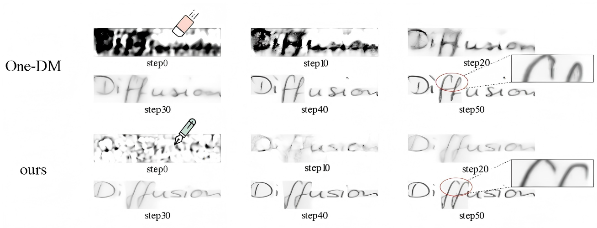
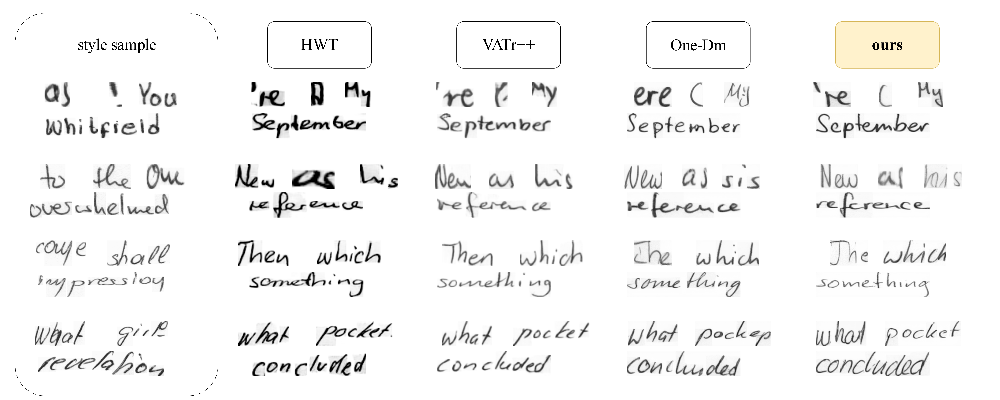

# AR-DiffHTG: Autoregressive-Conditional Diffusion for Structurally Coherent Handwritten Text Generation

> **Note:** This repository contains the official implementation of the paper **"AR-DiffHTG: Autoregressive-Conditional Diffusion for Structurally Coherent Handwritten Text Generation"**.

## 🚀 Introduction

**AR-DiffHTG** is a novel offline Handwritten Text Generation (HTG) framework designed to solve the structural collapse and "content drift" issues prevalent in existing diffusion-based methods.

By integrating an **Autoregressive Character Planner (ACP)** with an **Explicit Character Query Alignment (ECQA)** mechanism, our model achieves:

* **Structural Coherence:** Eliminates ghosting and character omission in variable-length text.
* **High-Fidelity Texture:** Leverages diffusion models for realistic ink bleeding and paper texture rendering.
* **SOTA Performance:** Outperforms One-DM, VATr++, and other baselines on IAM and CVL benchmarks.

<p align="center">


<em>Figure 1: Visual comparison of denoising trajectories. Unlike the "subtractive" denoising of One-DM, AR-DiffHTG employs a "constructive refinement" process via early structural locking.</em>
</p>


## 🛠️ Installation

### Prerequisites

* Linux or macOS
* Python 3.8+
* NVIDIA GPU (RTX 3090/4090 recommended) + CUDA 11.x/12.x

### Setup

```bash
git clone https://github.com/anonymous/AR-DiffHTG.git
cd AR-DiffHTG

# Create a virtual environment
conda create -n ardiffhtg python=3.9
conda activate ardiffhtg

# Install dependencies
pip install -r requirements.txt


## 📂 Data Preparation

### IAM Handwriting Database

1. Download the IAM dataset from the [official website](https://fki.tic.heia-fr.ch/databases/iam-handwriting-database).
2. Extract the data and organize it as follows:
```
data/
├── IAM/
│   ├── words/          # Original word images
│   ├── xml/            # Metadata
│   └── split/          # Official partition (train/test)

```


3. Run the preprocessing script to resize images to fixed height () and proportional width:
```bash
python preprocess_iam.py --root data/IAM --height 32

```


### CVL Database

Follow similar steps for the CVL dataset. Ensure you use the standard split (283 writers for training, 27 for evaluation).

## 🚅 Training

To train AR-DiffHTG from scratch on the IAM dataset:

```bash
python train.py \
  --dataset IAM \
  --data_root ./data/IAM \
  --batch_size 64 \
  --lr 2e-5 \
  --epochs 1000 \
  --exp_name iam_experiment_01

```

**Key Hyperparameters:**

* `--timesteps`: 50 (Total diffusion steps)
* `--style_dim`: 512
* `--planner_layers`: 12

## 🧪 Inference / Generation

To generate handwritten text images using a pre-trained model:

```bash
python inference.py \
  --checkpoint checkpoints/best_model.pth \
  --text "Hello World" \
  --style_ref img/sample_style.png \
  --output_dir outputs/

```

## 📊 Results

### Quantitative Comparison (IAM Test Set)

| Method | FID  | GS  | KID  |
| --- | --- | --- | --- |
| GANwriting | 28.37 | 5.67e-2 | -- |
| VATr++ | 16.29 | 1.94e-2 | 0.50 |
| One-DM | 15.73 | 0.20e-2 | 0.62 |
| **AR-DiffHTG (Ours)** | **12.08** | **0.18e-2** | **0.48** |

### Visual Samples

<p align="center">

</p>

## 📜 Citation

If you find this code helpful for your research, please cite our paper:

```bibtex
@inproceedings{ardiffhtg2026,
  title={AR-DiffHTG: Autoregressive-Conditional Diffusion for Structurally Coherent Handwritten Text Generation},
  author={Anonymous},
  booktitle={IEEE International Conference on Multimedia and Expo (ICME)},
  year={2026}
}

```

## 📄 License

This project is licensed under the MIT License - see the [LICENSE](https://www.google.com/search?q=LICENSE) file for details.

## 🙏 Acknowledgements

We thank the authors of [One-DM](https://github.com/dailenson/One-DM) for their open-source contributions, which served as a valuable baseline for our work.
